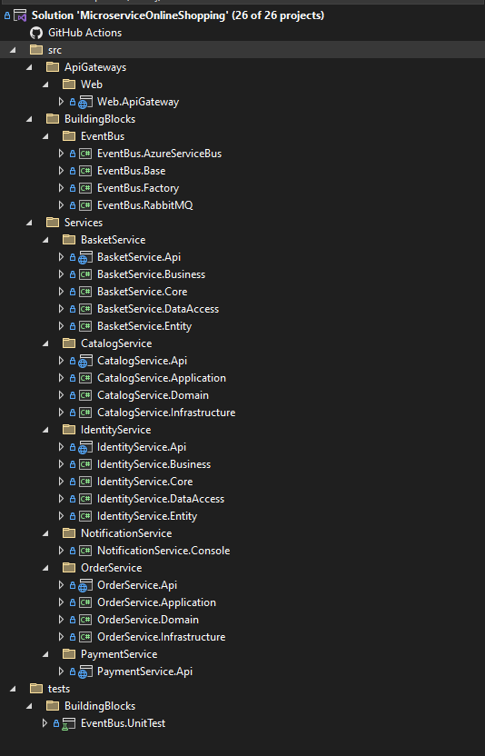

# Microservice Demo
> Demo application of an online shopping website built with microservice architecture.

This application is developed with microservice architecture. It aims to simulate the processes required for online shopping.
## Services

- Identity Service
- Catalog Service
- Basket Service
- Order Service
- Payment Service
- Notification Service

## Features and Workflow

- User and session management using Microsoft Identity. When a user login to system, user service sends an event to the notification service.
- Listing products by categories and crud operations for products and categories.
- Adding, updating, listing and deleting products in the basket. Sending items in the basket to the order service after the checkout process.
- Order management and sending created orders to the payment service.
- Simulates the payment process. If the order succeeds or fails, it sends the result to the notification service and the order service.
- The notification service shows notifications about processes on the screen.

>Communication between services is provided by EventBus.




This text you see here is *actually- written in Markdown! To get a feel
for Markdown's syntax, type some text into the left window and
watch the results in the right.

## Tech

This application uses a lot of technology.

- .NET CORE 8 
- RabbitMQ 
- Azure Service Bus 
- Ocelot 
- Consul 
- Redis 
- MSSQL 

## Project Solution

IMAGE

## Installation

-Install & start Docker Desktop: https://docs.docker.com/engine/install/


```sh
docker run -d -p 6379:6379 -p 8001:8001 --name myredis-stack --hostname my-redis-stack  redis/redis-stack:latest
docker run -d -p 8500:8500 -p 8600:8600 --name myconsul --hostname my-consul hashicorp/consul:latest
docker run -d -p 5672:5672 -p 15672:15672 --name myrabbit --hostname my-rabbit  -e RABBITMQ_DEFAULT_USER=user -e RABBITMQ_DEFAULT_PASS=password rabbitmq:3-management
```
## Event Bus Test
We can use unit test to test the EventBus.
IMAGE


